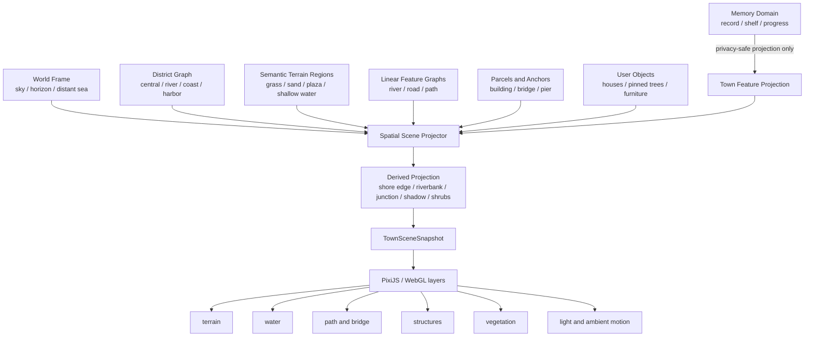
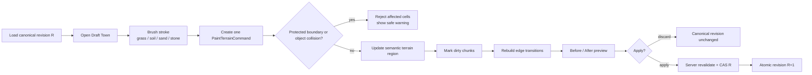
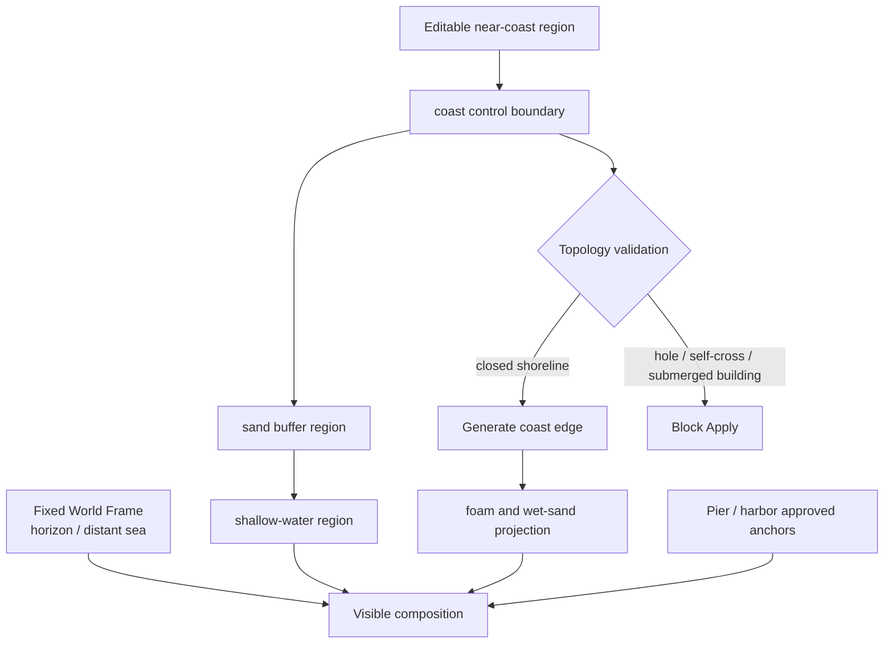
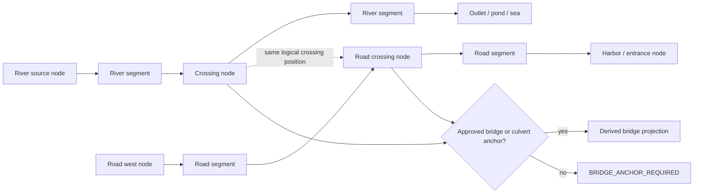
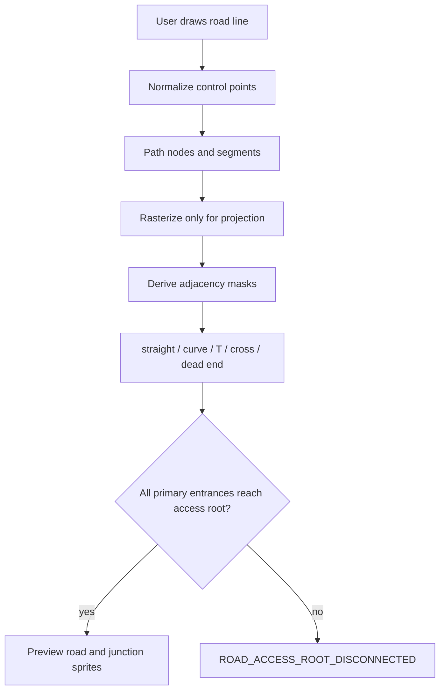
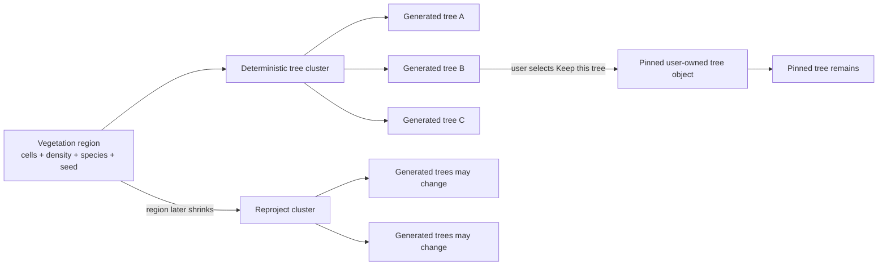
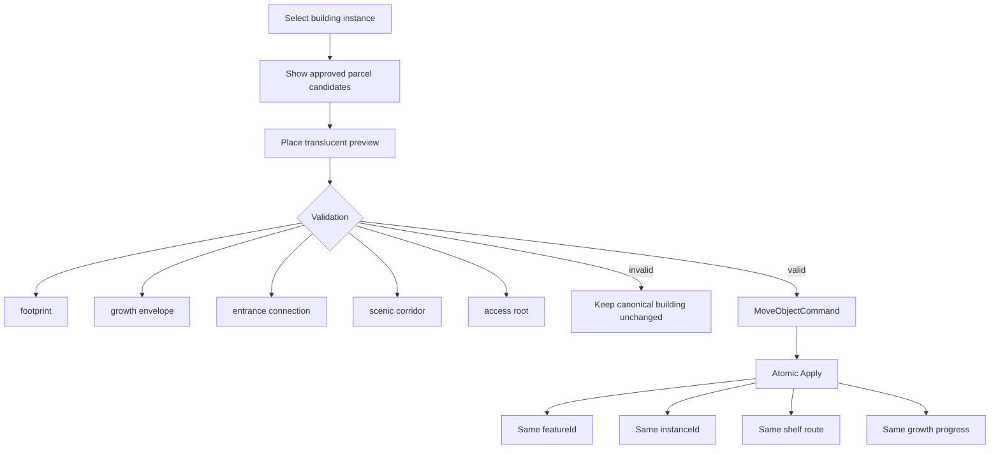
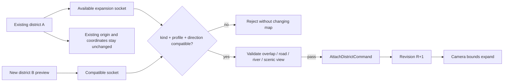
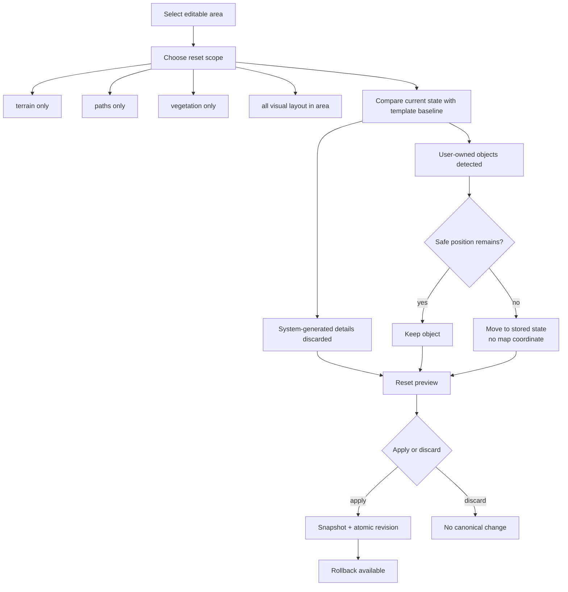
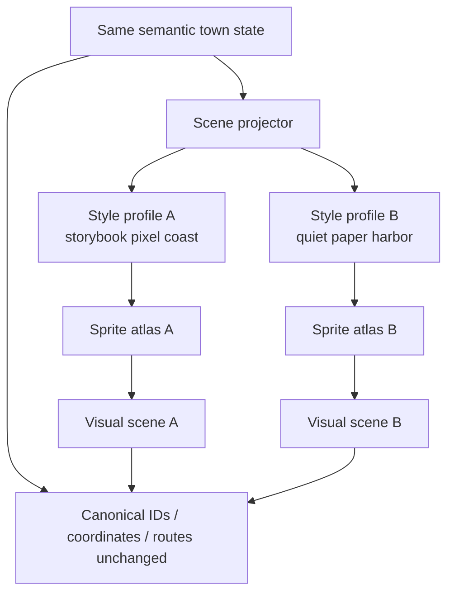

# Memory Town Editable Landscape Structural Diagrams E0–E9 — Round 7

最終更新: 2026-07-14

## Status

```txt
structural diagram specification:
created

GitHub Mermaid rendering:
available

mobile interaction prototype:
not created

final visual assets:
not created

implementation:
NO-GO
```

本書は完成景観を描く前に、同じ町が地形編集・建物移動・地区増築・asset差し替えへ耐えられるかを確認する構造図である。

---

# E0 — Exploded landscape layers



Binding decisions:

- Memory Domainは町の座標を持たない
- final sprite IDはcanonical stateではない
- World Frameと近景の編集可能地形を分離する
- derived projectionは再生成可能
- PixiJSは描画担当で、地形ルールの正本ではない

---

# E1 — Ground brush and protected areas



Required UX:

- one gesture = one undo unit
- brush does not silently move or delete a house
- locked plaza and landmark corridor stay protected
- invalid cells may be explained, but destructive automatic fixing is prohibited

---

# E2 — Coast and beach editing



Editable:

- beach width
- small cove
- small cape
- rock cluster
- coast vegetation
- pier at an approved anchor

Not freely editable initially:

- horizon
- distant island silhouette
- entire open sea
- land beneath occupied structure footprints

---

# E3 — River, road crossing and bridge



River validation:

- source and outlet exist
- every segment references existing nodes
- graph is connected in the intended direction
- district boundary uses a compatible river socket
- building footprint and riverbank clearance are respected

Bridge is not persisted as a random path tile. It is projected from a validated crossing contract and an approved bridge anchor.

---

# E4 — Road drawing and automatic junctions



Canonical state:

```txt
path kind
+ nodes
+ segments
+ surface profile
+ accessibility profile
```

Derived only:

```txt
connection mask
corner sprite
junction sprite
bridge approach sprite
path-side flowers and signs
```

---

# E5 — Forest region and pinned trees



Rules:

- forest is not stored as thousands of mandatory tree rows
- region edit avoids roads, rivers, entrances and structure clearance
- pinned trees survive forest density or boundary changes
- season changes sprite variants, not canonical species identity

---

# E6 — Building relocation without losing memory binding



Moving a cinema changes its place, not the movie records or the meaning of the feature.

---

# E7 — District expansion through sockets



Socket kinds:

- land
- road
- river
- coast
- harbor
- view

Expansion does not regenerate the existing town and does not move its origin.

---

# E8 — Area reset, stored objects and rollback



No reset flow may delete a user-owned object without an explicit separate deletion action.

---

# E9 — Same semantic town, different asset style



Must remain identical across style swap:

- terrain region IDs
- river and road graph IDs
- building instance IDs
- feature bindings
- district sockets
- memory records
- accessibility DOM routes

Allowed to change:

- sprite atlas
- palette
- texture
- wave and leaf animation profile
- derived edge and micro-detail visuals

---

# Cross-diagram invariants

```txt
Memory is the product.
Landscape is semantic state.
Final art is projection.
Preview is not canonical.
User objects are never silently destroyed.
Existing coordinates do not move during expansion.
The town remains usable without WebGL.
```

# Evidence still missing

- diagrams rendered and reviewed on mobile
- touch editing prototype
- actual coast topology validator
- river continuity validator
- positive bridge asset prototype
- building footprint / parcel fixtures
- area reset command schema
- V0–V4 same-town visual image sequence
- performance and accessibility review
